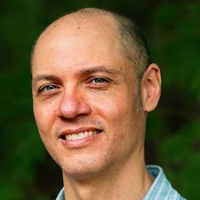
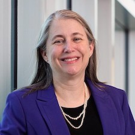
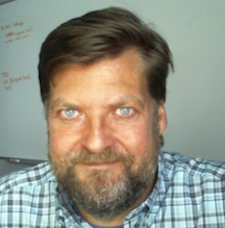
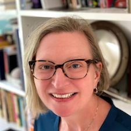

Both plenary sessions will be recorded and recordings will be made publicly available on this website.

## Week 1: March 1, 2022 Plenary (13:15-14:15 ET)

*Speakers:* Dr. Ryan Emanuel & Dr. Alyson Wilson  
*Host:* Dr. Sheila Saia

 

### Dr. Ryan Emanuel

Dr. Ryan Emanual (he/him) is an Associate Professor of Hydrology at Duke University, an environmental scientist, and a community-engaged scholar from North Carolina. He studies ecohydrology, biogeosciences, environmental justice, and Indigenous rights. Ryan leads a group of researchers who study the environment and relationships between people and the environment in North Carolina and beyond. His group also partners with Native American Tribes and other communities to understand environmental change through the lenses of environmental justice and Indigenous rights. This work involves research, education, and relationship-building. His goal is to amplify voices of Indigenous and other marginalized communities who shoulder disproportionate environmental burdens.

[Dr. Emanuel's Website](https://scholars.duke.edu/person/Ryan.Emanuel)

 

### Dr. Alyson Wilson

Dr. Alyson Wilson (she/her) is the Associate Vice Chancellor for National Security and Special Research Initiatives at North Carolina State University. She is also a professor in the Department of Statistics and principal investigator for the Laboratory for Analytic Sciences. She is a Fellow of the American Statistical Association and the American Association for the Advancement of Science. Her research interests include statistical reliability, Bayesian methods, and the application of statistics to problems in defense and national security.

[Dr. Wilson's Website](https://alysongwilson.github.io/)

 

## Week 2: March 8, Plenary (13:15-14:15 ET)

*Speakers:* Dr. Deke Arndt & Dr. Chelle Gentemann  
*Host:* Dr. Douglas Rao

 

### Dr. Deke Arndt

Dr. Deke Arndt (he/him) is the Director of the Climatic Science and Services Division at NOAA’s National Centers for Environmental Information. Deke’s career began in 1996 at the Oklahoma Climatological Survey, and he has worked closely with public safety, agriculture, climate monitoring, and the energy generation and transmission sectors. In recent years, he has served on the Council of the American Meteorological Society, been a co-lead editor of the AMS's annual State of the Climate report, and co-chaired the US Global Change Research Program's Interagency Indicators Working Group.

[Dr. Arndt's Website](https://www.linkedin.com/in/deke-arndt/)

 

### Dr. Chelle Gentemann

Dr. Chelle Gentemann (she/her) is a Senior Scientist with Farallon Institute. Chelle is a passionate advocate for open science, open source software, and inclusivity. As a physical oceanographer focused on remote sensing, she has worked for over 25 years on retrievals of ocean temperature from space and using that data to understand how the ocean impacts our lives. Her more recent research focuses on interdisciplinary science using cloud computing, open source software algorithm development, air-sea fluxes, biophysical interactions, and upper ocean physical processes. She has served on scientific committees, notably as co-chair of a standing committee for the National Academy of Sciences and has presented to a federal house committee on NASA’s implementation of scientific community priorities.

[Dr. Gentemann's Website](http://www.faralloninstitute.org/chelle)